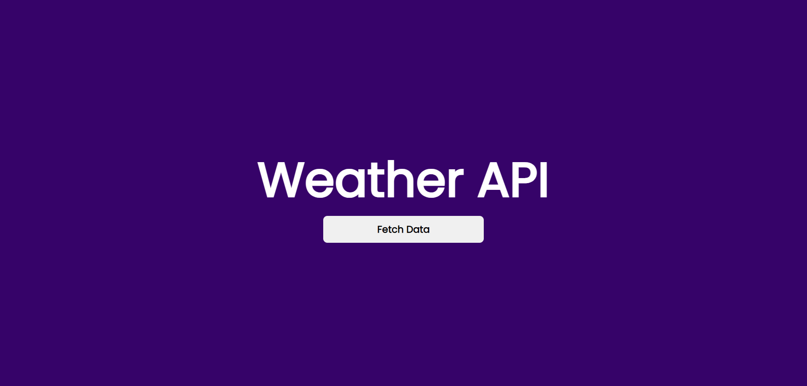
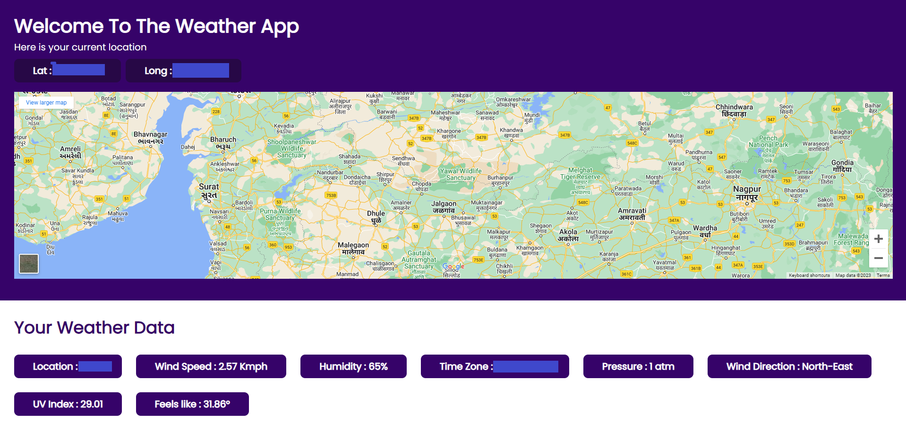

# Landing-Page
Introducing Weather API App, a sleek and user-friendly weather application designed to provide real-time weather updates effortlessly. This project is built on HTML, CSS and JS fully responsive:

## How To Use This Repo
Download this repo and run in `VScode` with extension `Live Server`  and you are done 

### `Final Output`

